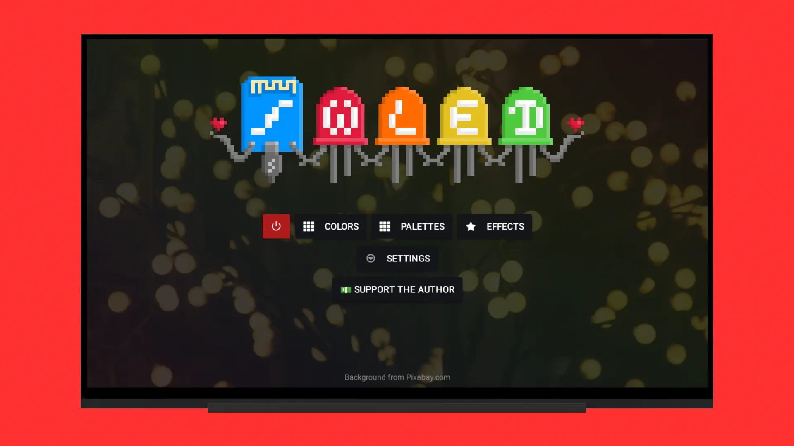

# //WLED TV App

**Hi everyone!** In my 15 years I created the **WLED TV App** project - an application for **Android TV 5.1+** written in **Java** (Android Studio).

The third-party libraries used are:
 - com.squareup.okhttp3:okhttp:4.4.0

and others

The app uses **webview** to display the WLED setup pages, but these have been **optimized for remote control operation** and **have been stripped down** for fast operation on a TV.

⚠️ **I am not a professional coder and actively used neural networks when creating the project. Nevertheless, it turned out to be a pretty good project.**

Based on [WLED](https://github.com/wled/WLED) official project
## [Google Play](https://play.google.com/store/apps/details?id=com.ymp.wled.tv)

